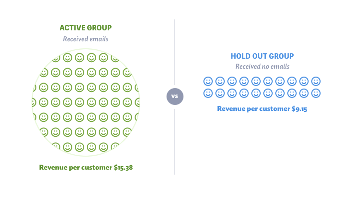
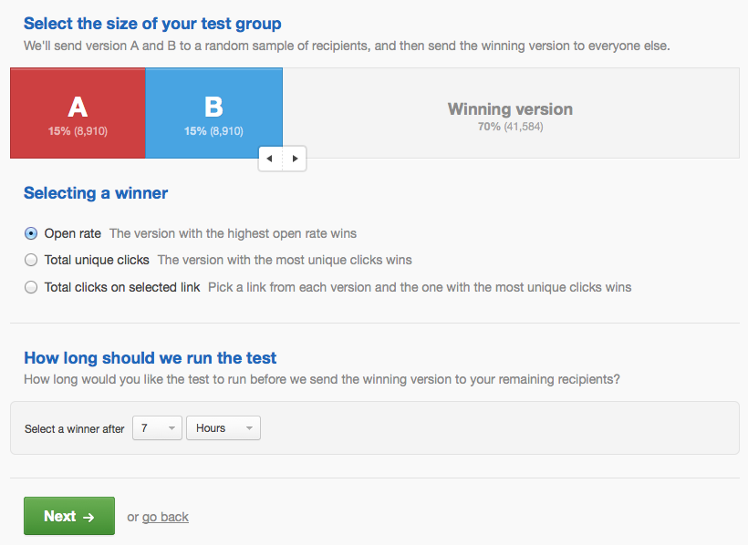

```{r setup, include=FALSE}
library(rstan)
library(dplyr)
options(mc.cores = parallel::detectCores())
setwd("~/Documents/GitHub/testandroll")
source("nn_functions.R")
```

## Thanks to Drexel & Wharton

[Drexel MS Business Analtyics (Fall applications due 9/15)](https://www.lebow.drexel.edu/land/masters/business-analytics)  
[Drexel MS Marketing (Fall applications due 9/15)](https://www.lebow.drexel.edu/land/masters/marketing)  
[Drexel Business Analytics Meetup (open to all!)](https://www.meetup.com/analyticslebow/)  
[Drexel Solutions Institute](https://drexel.edu/solutions-institute/)

[Wharton Online Certificate in Digital Marketing](https://online.wharton.upenn.edu/programs/?vm_vt=1#digital-marketing)  
[Wharton Exec Ed Course in Customer Analtyics](https://executiveeducation.wharton.upenn.edu/for-individuals/all-programs/customer-analytics-for-growth-using-machine-learning-ai-and-big-data/)  
[Analytics at Wharton](https://www.wharton.upenn.edu/analytics/)  

## A/B Testing  
{width=75%}  

## Holdout Testing  
{width=75%}   

## Workshop Goals
In this session, I'd like to introduce you to an alternative way of planning and analyzing an A/B test, which is based on *Bayesian decision theory*. We think this approach has a lot of advantages, so Ron and I gave it a name: **Test & Roll**.  

We are marketing professors, after all!  


## Workshop materials  
[Slides](https://eleafeit.github.io/testandroll/howto/How_To_Test_and_Roll.html#1)  

Those familiar with R Markdown can open the [R Markdown file that created the slides](https://raw.githubusercontent.com/eleafeit/testandroll/master/howto/How_To_Test_and_Roll.Rmd) in R Studio and run the code as we go along.   
- Requires `rstan` and `dplyr` packages  
- Requires [nn_functions.R](https://raw.githubusercontent.com/eleafeit/testandroll/master/nn_functions.R) with some additional functions I wrote.

Those unfamiliar with R Markdown (or just tired) should follow the slides without trying to run the code.  

## What I expect participants already know
I just told you about A/B tests, *but ask questions!*

I will assume you know what a probability distribution like the normal distribution is, *but ask questions!*

I expect you are comfortable reading R. I will use mathematical calculations, for loops, and plotting, *but ask questions!

You do not need to know how plan and analyze an A/B test using hypothesis testing, but see [previous R Ladies Philly workshop on A/B testing](https://www.youtube.com/watch?v=QXpYtM-Zlxg&t=8s).


# How to analyze an A/B test using Bayesian inference

## Bayesian Analysis for A/B Tests
The data from an A/B test comparing the time users spend on your website for two versions of the homepage is in the data frame `test_data`. A summary of the data looks like this: 
```{r, echo=FALSE}
# Generate synthetic data
set.seed(19104)
group <- c(rep("A", 500), rep("B", 500)) 
time_on_site <- c(rnorm(500, mean=5.2, sd=2), rnorm(500, mean=5.4, sd=2.2))
test_data <- data.frame(group, time_on_site)
rm(group, time_on_site)
```
```{r, echo=TRUE, message=FALSE}
test_data %>% 
  group_by(group) %>% summarize(mean=mean(time_on_site), sd=sd(time_on_site), n=n())
```
It looks like the B version keeps users on the site a bit longer, but how sure are we that B produces longer visits on average? We've only seen 500 visitors in each group.

## Prior beliefs
I would like to know what the mean time-on-site is for the A group and the B group. 

Before I saw this data, I knew nothing about how long people might spend on this website. They might stay for 5 seconds or they might stay for 5 hours.  

Formally, I can describe my prior beliefs with a *prior distribution*: 
$$\textrm{mean time-on-site for group} \sim N(0, 100^2)$$  

## Prior beliefs  
I find it easier to draw a picture of my prior.
```{r, echo=FALSE}
# Plot the prior
plot(x=-300:300, y=dnorm(-300:300, mean=0, sd=100), 
     type="l", col="gray", xlab="mean time-on-site (m)", ylab="prior density")
```


## Posterior beliefs
Bayes rule tells you how you should update your beliefs after you see some data. This is also easier to see with a picture.
```{r, echo=FALSE}
# Plot the posterior
n_A <- sum(test_data$group=="A")
n_B <- sum(test_data$group=="B")
s <- sd(test_data$time_on_site)
post_mean_A <- mean(test_data[test_data$group=="A", "time_on_site"])
post_mean_B <- mean(test_data[test_data$group=="B", "time_on_site"])
post_sd_A <- (1/100^2 + n_A/s^2)^-(1/2)
post_sd_B <- (1/100^2 + n_B/s^2)^-(1/2)
plot(x=(450:600)/100, y=dnorm((450:600)/100, mean=post_mean_A, sd=post_sd_A), 
     type="l", col="blue", xlab="mean time-on-site (m)", ylab="posterior density")
lines(x=(450:600)/100, y=dnorm((450:600)/100, mean=post_mean_B, sd=post_sd_B), col="red")
lines(x=(450:600)/100, y=dnorm((450:600)/100, mean=0, sd=100), col="gray")
legend("topright", col=c("blue", "red", "gray"), legend=c("posterior for A", "posterior for B", "prior"), bty="n", lty=1)
```

## Model details (mathematically)
 If we assume that the time-on-site for each customer is distributed normally: 
$$\textrm{time-on-site} \sim \mathcal{N}(\textrm{mean time-on-site for group}, s^2)$$
Then Bayes rule tells us that the posterior distribution for mean time-on-site for each group should be: 
$$\textrm{mean time-on-site for group given data} \sim \mathcal{N}\left(\overline{y}, \left(\frac{1}{100^2} + \frac{n}{s^2}\right)^{-1}\right)$$  

I'm skipping the derivation. Hope you don't mind!

## Code for posterior updating
```{r, eval=FALSE}
n_A <- sum(test_data$group=="A") # obs for A
n_B <- sum(test_data$group=="B") # obs for B
s <- sd(test_data$time_on_site) # standard deviation of data (approx)

# Posterior mean is just the mean for each group
post_mean_A <- mean(test_data[test_data$group=="A", "time_on_site"])
post_mean_B <- mean(test_data[test_data$group=="B", "time_on_site"])

# Posterior standard deviation follows this formula
post_sd_A <- (1/100^2 + n_A/s^2)^-(1/2)
post_sd_B <- (1/100^2 + n_B/s^2)^-(1/2)
```

## Credible intervals for groups
If you like intervals, we can compute a 95% credible intervals for each group, by cutting off the left and right 2.5% of the posterior distribution.  In this case, our posterior is normal, so we use the `qnorm()` function, which computes quantiles of the normal distribution.

There is a 95% probability that the average time-on-site for treatment A is:
```{r}
qnorm(c(0.025, 0.975), mean=post_mean_A, sd=post_sd_A) # CI for A
```
There is a 95% probability that the average time-on-site for treatment B is:
```{r}
qnorm(c(0.025, 0.975), mean=post_mean_B, sd=post_sd_B) # CI for B
```

## Posterior for the difference between A and B
We can also compute the posterior distribution for the difference between the mean time-on-site for the B group and the mean time-on-site for the A group. 
```{r, echo=FALSE}
# Plot the posterior for the DIFFERENCE
post_mean_diff <- post_mean_B - post_mean_A 
post_sd_diff <- sqrt(post_sd_B^2 + post_sd_A^2)
plot(x=(-50:60)/100, y=dnorm((-50:60)/100, mean=post_mean_diff, sd=post_sd_diff), 
     type="l", col="black", 
     xlab="difference in mean time-on-site (m)", ylab="posterior density")
abline(v=0)
text(-0.25, 2.9, "A has higher mean time-on-site")
text(0.35, 2.9, "B has higher mean time-on-site")
```

## Posterior for the difference between A and B
Since the posterior for A and the posterior for B are both normal, the posterior for the difference is also normal with mean and standard deviation: 
```{r, eval=FALSE}
post_mean_diff <- post_mean_B - post_mean_A
post_sd_diff <- sqrt(post_sd_B^2 + post_sd_A^2)
```

Once we have the distribution for the difference in the mean time-on-site, we can compute the probability that the mean of B is greater than the mean of A. 
```{r}
1-pnorm(0, mean=post_mean_diff, sd=post_sd_diff)
```
It is up to the decision maker to decide whether they would like to use version B knowing that there is a 63% change that B is better than A. This depends on how costly it is to deploy B. 

## More on prior beliefs
Many people get hung up on priors. **Don't!**

As you get more data, the posterior becomes more and more influenced by the data. In most practical situations you have enough data that the priors do not affect the analysis much.

If you have prior information, priors are a principled way to bring it in. 

Priors are also useful when planning an A/B test (more later).

## More on prior beliefs
When we don't want our priors to influence the outcome, we use "flat" priors. The prior we jused puts nearly equal weight on 4.5 minutes versus 6 minutes, so it is pretty flat.   
```{r, echo=FALSE}
# Plot the posterior (again)
plot(x=(450:600)/100, y=dnorm((450:600)/100, mean=post_mean_A, sd=post_sd_A), 
     type="l", col="blue", xlab="mean time-on-site (m)", ylab="posterior density")
lines(x=(450:600)/100, y=dnorm((450:600)/100, mean=post_mean_B, sd=post_sd_B), col="red")
lines(x=(450:600)/100, y=dnorm((450:600)/100, mean=0, sd=100), col="gray")
legend("topright", col=c("blue", "red", "gray"), legend=c("A", "B", "prior"), bty="n", lty=1)
```

## More on prior beliefs
In this analysis I used the same prior for both A and B because I know nothing about A and B.   

*Important*: using the same prior for A and B is *not the same* as assuming A and B have the same mean time-on-site. Priors reflect our uncertainty about A and B. Becuase we are uncertain, A might be better than B or B better than A.

You can use priors that reflect your (justifiable) prior beliefs. For instance, if A is a discount and B is no discount and our outcome is how much you purchase, then I'm pretty sure A will be as good as or better than B. 

## How to analyze an A/B test using Bayesian analysis
1. Pick treatments and an outcome to measure
2. Randomly assign A and B to some users and record outcomes
3. Quantify your beliefs about the outcome with a prior distribution
4. Update your beliefs according to Bayes rule (posterior distribution)
5. Plot your updated belief distribution; compute intervals and probabilities
6. Make a decision or **go to 3**

## [Questions?](https://docs.google.com/document/d/1phklSbRQPeINqzx0eerxLyY0ILn_CFxQ1OgBDZtC6GE/edit)

# How to **Test & Roll**

## Typical A/B email test setup screen
{width=75%}

## A/B test planning as a decision problem
### Test
Choose $n_1^*$ and $n_2^*$ customers to send the treatments.  
Collect data on profit for both treatments.  

### Roll
Choose a treatment to deploy to the remaining $N - n_1^* - n_2^*$ customers.

### Objective
Maximize combined profit for test stage and the roll stage.   

## Profit-maximizing sample size
If you have a test where the **profit** earned for each customer is:   
$y \sim \mathcal{N}(m_1, s)$ for group 1   
$y \sim \mathcal{N}(m_2, s)$ for group 2   

and your priors are  
($m_1, m_1 \sim N(\mu, \sigma)$)  

the profit maximizing sample size is:  
$$n_1 = n_2 = \sqrt{\frac{N}{4}\left( \frac{s}{\sigma} \right)^2 + \left( \frac{3}{4} \left( \frac{s}{\sigma} \right)^2  \right)^2 } -  \frac{3}{4} \left(\frac{s}{\sigma} \right)^2$$
This new sample size formula is derived in [Feit and Berman (2019) *Marketing Science*](https://papers.ssrn.com/sol3/papers.cfm?abstract_id=3274875).

## Compute the sample size in R
```{r}
source("~/Documents/GitHub/testandroll/nn_functions.R") # some functions I wrote
N <- 100000 # available population
mu <- 0.68  # average conversion rate across previous treatments
sigma <- 0.03 # range of expected conversation rates across previous treatments
s <- mu*(1-mu) # binomial approximation
test_size_nn(N=N, s=s, mu=mu, sigma=sigma) # compute the optimal test size
```

## Why is this the profit-maximizing test size? 
`test_eval_nn()` computes the profit of a Test & Roll.
```{r}
# Optimal test size
n_star <- test_size_nn(N=N, s=s, mu=mu, sigma=sigma)
test_eval_nn(n=n_star, N=N, s=s, mu=mu, sigma=sigma)
```

## Why is this the profit-maximizing test size? 
```{r}
# Bigger test
test_eval_nn(n=c(10000, 10000), N=N, s=s, mu=mu, sigma=sigma)
```
```{r}
# Smaller test
test_eval_nn(n=c(100, 100), N=N, s=s, mu=mu, sigma=sigma)
```

## Why is this the profit-maximizing test size? 
```{r, echo=FALSE}
# Plot expected profit as a function of test size
# NHT for comparison
d <- 0.68*0.02 # 2% lift 
n_nht <- test_size_nht(s=sqrt(mu*(1-mu)), d=d) # to match the profit maximizing
eval_nht <- test_eval_nn(n=rep(n_nht, 2), N=N, s=sqrt(mu*(1-mu)), mu=mu, sigma=sigma)
# Plot
n <- c(1:19, 2:19*10, 2:19*100, 2:19*1000, 2:5*10000)
out <- NULL
for (i in 1:length(n)) {
  out <- rbind(out, test_eval_nn(n=c(n[i], n[i]), N=N, s=sqrt(mu*(1-mu)), mu=mu, sigma=sigma))
}
plot(out$n1, out$profit, type="l", 
     ylim=c(out$profit_rand[1], out$profit_perfect[1]),
     xlab=expression("Test Size (n"[1]*"=n"[2]*")"), ylab="Expected Profit")
abline(v=n_star)
text(n_star, 0.696*N, "n*=2,284", pos=4)
abline(v=n_nht, col="gray", lty=3)
text(n_nht, 0.683*N, expression(n[HT]), col="gray", pos=4)  # hard code
```

## How often do you deploy the wrong treatment? 
```{r, echo=FALSE}
# Plot the error rate as a function of test size
plot(out$n1, out$error_rate, type="l", ylim=c(0, 0.5),
     xlab=expression("Test Size (n"[1]*"=n"[2]*")"), ylab="Error Rate")
abline(v=n_star)
text(n_star, 0.13, "n*=2,284", pos=4)
abline(v=n_nht, col="gray", lty=3)
text(n_nht, 0.3, expression(n[HT]), col="gray", pos=4)
```

## Profit-maximizing sample size
The `test_size_nn()` function is making the optimal trade-off between: 

- the opportunity cost of the test (You are sending the wrong treatment to half your customers!)  

and 

- the risk of deploying the wrong treatment 

# How to choose `N`, `mu`, `sigma` and `s`

## What is `N`?
`N` is the total number of customers you have available, i.e. the size of your email mailing list or the the number of visits that might visit a webpage in the next month.

Let's vary `N` and look at how the profit-maximizing test size changes:
```{r}
Ns <- (1:1000)*1000
test_sizes <- rep(NA, length(Ns))
for (i in 1:length(Ns)) 
  test_sizes[i] <- test_size_nn(N=Ns[i], s=s, mu=mu, sigma=sigma)[1]
```
```{r, eval=FALSE}
plot(x=Ns, y=test_sizes, type="l", col="orange",
     xlab="available population (N)", ylab="profit-maximizing sample size")
```


## What is `N`? 
Bigger `N` $\rightarrow$ bigger test 
```{r, echo=FALSE}
plot(x=Ns, y=test_sizes, type="l", col="orange",
     xlab="available population (N)", ylab="profit-maximizing sample size")
```

## What is `mu`? 
`mu` is the average profit you expect across treatments you might test.

Let's vary `mu`: 
```{r}
mus <- (1:1000)/100
test_sizes <- rep(NA, length(mus))
for (i in 1:length(mus)) 
  test_sizes[i] <- test_size_nn(N=N, s=s, mu=mus[i], sigma=sigma)[1]
```
```{r, eval=FALSE}
plot(x=mus, y=test_sizes, type="l", col="orange",
     xlab="expected average profit per customer (mu)", ylab="profit-maximizing sample size")
```

## What is `mu`?
`mu` doesn't effect the test size (when `mu` is the same for both A and B)
```{r, echo=FALSE}
plot(x=mus, y=test_sizes, type="l", col="orange",
     xlab="expected average profit per customer (mu)", ylab="profit-maximizing sample size")
```

## What is `s`?
`s` is how variable the profit is from one customer to another.

Let's vary `s`: 
```{r}
ss <- (1:1000)/1000
test_sizes <- rep(NA, length(ss))
for (i in 1:length(ss)) 
  test_sizes[i] <- test_size_nn(N=N, s=ss[i], mu=mu, sigma=sigma)[1]
```
```{r, eval=FALSE}
plot(x=ss, y=test_sizes, type="l", col="orange",
     xlab="noise in profit per customer (s)", ylab="profit-maximizing sample size")
```

## What is `s`? {.smaller}
Bigger `s` $\rightarrow$ harder to see what is going on $\rightarrow$ bigger test 
```{r, echo=FALSE}
plot(x=ss, y=test_sizes, type="l", col="orange",
     xlab="noise in profit per customer (s)", ylab="profit-maximizing sample size")
```    

Hypothesis testing requires much bigger sample sizes (proportional to `s^2` instead of `s`). 

## What is `sigma`? 
`sigma` defines the difference we expect between average profit for the two treatments.
```{r}
plot_prior_effect_nn(mu, sigma, abs=TRUE)
```

## What is `sigma`? 
Let's vary `sigma`: 
```{r}
sigmas <- (1:1000)/10000
test_sizes <- rep(NA, length(sigmas))
for (i in 1:length(sigmas)) 
  test_sizes[i] <- test_size_nn(N=N, s=s, mu=mu, sigma=sigmas[i])[1]
```
```{r, eval=FALSE}
plot(x=sigmas, y=test_sizes, type="l", col="orange",
     xlab="prior sd of treatment mean profit (sigma)", ylab="profit-maximizing sample size")
```

## What is `sigma`?
Bigger `sigma` $\rightarrow$ bigger difference between A and B  $\rightarrow$ smaller test 
```{r, echo=FALSE}
plot(x=sigmas, y=test_sizes, type="l", col="orange",
     xlab="prior sd of treatment mean profit (sigma)", ylab="profit-maximizing sample size")
```

# How to come up with `s` and `sigma` for your own test

## Data on previous treatments
```{r, echo=FALSE}
# Generate synthetic data on previous A/B tests
generate_syn_expt <- function(nexpt, nobs, mu, sigma, omega) {
  nobs <- matrix(nobs, nrow=nexpt, ncol=2) # equal test sizes
  y <- matrix(NA, nrow=nexpt, ncol=2)
  for (e in 1:nexpt) {
    t <- rnorm(1, mean=mu, sd=omega)
    m <- rnorm(2, mean=t, sd=sigma)
    while (min(t,m) < 0 | max(t,m) > 1) { # reject values outside [0,1] 
      t <- rnorm(1, mean=mu, sd=omega)
      m <- rnorm(2, mean=t, sd=sigma)
    }
    y[e, 1] <- mean(rnorm(nobs[e,1], mean=m[1], sd=sqrt(m[1]*(1-m[1]))))
    y[e, 2] <- mean(rnorm(nobs[e,2], mean=m[2], sd=sqrt(m[2]*(1-m[2]))))
  }
  colnames(y) <- c("A_conv_rate", "B_conv_rate")
  list(nexpt=nexpt, y=y, nobs=nobs)
}
set.seed(19980103)
expts <- generate_syn_expt(nexpt=100, nobs=100000, 
                           mu=0.676, sigma=0.030, omega=0.199) # pop estimates from paper
```
Suppose you have data on some previous A/B tests that represent the range of results you might expect from the treatments in the test you are planning. 
```{r}
head(expts$y)
```
This data is synthetic data that is similar to data we have from a large A/B testing platform. In the data we have `conv_rate` is the number of users who click anywhere on a website. 

## Meta-analyze past experiments
Assume that this data represents the range of performance that we might see in the test we are planning. 

We can fit a model to this data to estiamte `mu` and `sigma` for these types of tests.

We'll use [Stan](mc-stan.org), which is a flexible, open-source tool for Bayesian modeling. You can access Stan by installing the `rstan` package.

## Hierarchical Stan model for past experiments {.smaller}
```{stan, output.var="stan_model"}
data {
  int<lower=1> nexpt; // number of experiments
  real<lower=0,upper=1> y[nexpt,2]; // observed mean response for each arm
  int nobs[nexpt,2]; // sample size for each arm (1 and 2)
}
parameters {
  real<lower=0, upper=1> m[nexpt,2]; 
  real<lower=0, upper=1> t[nexpt];
  real<lower=0, upper=1> mu;
  real<lower=0> sigma; 
  real<lower=0> omega; 
}
model {
  // priors
  mu ~ normal(0.5, 0.1);
  omega ~ normal(0, 0.1);   
  sigma ~ normal(0, 0.1); 
  // likelihood
  for (i in 1:nexpt) {
    t[i] ~ normal(mu, omega);
  	m[i,1] ~ normal(t[i], sigma);
    m[i,2] ~ normal(t[i], sigma);
    y[i,1] ~ normal(m[i,1], sqrt(m[i,1]*(1-m[i,1])/nobs[i,1])); 
	  y[i,2] ~ normal(m[i,2], sqrt(m[i,2]*(1-m[i,2])/nobs[i,2]));
  }
}
```


## Fit Stan model to past experiments
```{r, include=TRUE, cashe=TRUE}
m1 <- sampling(stan_model, data=expts, seed=20030601, iter=1000)
```

## Fitted parameters
We're interested in `mu`, which is the average profit per customer across all the tests and `sigma`, which is the variation between the A and B groups *within* a test. 
```{r}
summary(m1, pars=c("sigma", "mu"))$summary[,c(1,3,5,8)]
```

## Compute optimal sample size
```{r}
(n_star <- test_size_nn(N=100000, mu=0.68, sigma=0.029, s=0.68*(1-0.68)))
```
```{r}
test_eval_nn(n_star, N=100000, mu=0.68, sigma=0.029, s=0.68*(1-0.68))
```

## Then we run the test somewhere out in the world and get some data...
```{r, echo=FALSE}
# Generate synthetic data for current A/B test
set.seed(19348)
group <- c(rep("A", 1272), rep("B", 1272)) 
profit <- c(rnorm(1272, mean=0.51, sd=0.5*(1-0.5)), 
            rnorm(1272, mean=0.50, sd=0.53*(1-0.53)))
test_data <- data.frame(group, profit)
rm(group, profit)
```
```{r}
test_data %>% 
  group_by(group) %>% summarize(mean=mean(profit), sd=sd(profit), n=n())

```

## How to decide what to roll
To decide which treatment to delpoy, we compute the posteriors for each group.
```{r}
n_A <- sum(test_data$group=="A")
n_B <- sum(test_data$group=="B")
s <- sd(test_data$profit)
post_mean_A <- mean(test_data[test_data$group=="A", "profit"])
post_mean_B <- mean(test_data[test_data$group=="B", "profit"])
post_sd_A <- (1/100^2 + n_A/s^2)^-(1/2)
post_sd_B <- (1/100^2 + n_B/s^2)^-(1/2)
```

## How to decide what to roll
```{r, echo=FALSE}
plot(x=(400:600)/1000, y=dnorm((400:600)/1000, mean=post_mean_A, sd=post_sd_A), 
     type="l", col="blue", xlab="mean profit", ylab="posterior density")
lines(x=(400:600)/1000, y=dnorm((400:600)/1000, mean=post_mean_B, sd=post_sd_B), col="red")
lines(x=(400:600)/1000, y=dnorm((400:600)/1000, mean=0, sd=100), col="gray")
legend("topright", col=c("blue", "red", "gray"), legend=c("posterior for A", "posterior for B", "prior"), bty="n", lty=1)
```

## How to decide what to roll
The posterior mean is our best guess at how well the treatment will perform. Our expected profit is maximized when we choose the treatment with the higher posterior mean (cf. [Berger](https://www.springer.com/gp/book/9780387960982)). 

But, when the priors for A and B are the same, then the posterior is just the average profit in the test. 
```{r}
post_mean_A <- mean(test_data[test_data$group=="A", "profit"])
post_mean_B <- mean(test_data[test_data$group=="B", "profit"])
```

**So, you can skip the Bayesian analysis!** Just compute the average profit for each group and deploy the treatment with the higher profit. 

That's why we call it Test & **Roll**.

# Summary: How to Test and Roll

## 1. Come up with priors  
If you have data on past treatments that are similar to the ones you plan to test, fit a hierarchcial model. 
```{r, eval=FALSE}
# define a stan model (not shown)
# estimate the model with your prior data
m1 <- sampling(stan_model, data=expts, seed=20030601, iter=1000)
```
```{r, eval=TRUE}
summary(m1, pars=c("sigma", "mu"))$summary[,c(1,3,5,8)]
```
The data doesn't have to be A/B tests. For example, you could use past response rates on regular email campaigns.

## 2. Use priors to compute sample size
```{r, eval=TRUE}
(n_star <- test_size_nn(N=100000, mu=0.68, sigma=0.026, s=0.68*(1-0.68)))
test_eval_nn(n_star, N=100000, mu=0.68, sigma=0.026, s=0.68*(1-0.68))
```

## 3. Run the test & collect data
This can be done using any A/B testing tool that works with the medium you are testing.

## 4. Deploy  treatment with higher average profit
```{r, eval=TRUE}
test_data %>% 
  group_by(group) %>% summarize(mean=mean(profit), sd=sd(profit), n=n())
```

## That was just five lines of code
```{r, eval=FALSE}
m1 <- sampling(stan_model, data=expts, seed=20030601, iter=1000)
summary(m1, pars=c("omega", "sigma", "mu"))$summary[,c(1,3,5,8)]
(n_star <- test_size_nn(N=100000, mu=0.68, sigma=0.026, s=0.68*(1-0.68)))
test_eval_nn(n_star, N=100000, mu=0.68, sigma=0.026, s=0.68*(1-0.68))
test_data %>% 
  group_by(group) %>% summarize(mean=mean(profit), sd=sd(profit), n=n())
```

# A few more things you should know how to do

## You can have different priors for A and B
```{r}
mu <-  c(20, 30); sigma <-  c(10, 20); s <- c(100, 200)
plot_prior_mean_resp_nn(mu=mu, sigma=sigma)
```

## And different priors lead to different sample sizes
```{r}
test_size_nn(N=100000, mu=mu, sigma=sigma, s=s)
```

## Why not Hypothesis Testing?
What if recommended sample size is larger than available population?   

Which treatment should be deployed if the difference is non-significant?   

False positives do not reduce profit in this setting. Why control them?   

Can't rationalize unequal test group sizes   

## Hypothesis Test versus Test & Roll

### Hypothesis tests are for science
- Want to know which treatment is better with high confidence  
- Don’t explicitly consider the cost of the experiment   
- Generally requires much larger sample sizes   

### Test & Roll is for marketing  
- Want to select treatments that maximize profits  
- Considers the cost of the test relative to the error rate  
- Generally requires small sample sizes that are scaled  

## Learning more
If you don't like R code check out the [Test & Roll Shiny App](http://testandroll.com)

If you want to dive into the details of Test & Roll, check out our paper [Feit and Berman (2019)](https://papers.ssrn.com/sol3/papers.cfm?abstract_id=3274875).

There is complete [replication code for the paper](https://github.com/eleafeit/testandroll/tree/master/replication)

Chris Said (Stitch Fix) wrote a [blog post outlining a similar approach framed as discounting](https://twitter.com/Chris_Said/status/1215733430085804032). 

## Coming soon 
R package to make the functions in `nn_functions.R` more accessible.  

Improvements to the Shiny App  

A new paper on latent stratification  

## Thanks!  {.smaller}
**Elea McDonnell Feit**  
Associate Professor of Marketing  
LeBow College of Business  
Drexel University  
@eleafeit  
eleafeit.com  

**Ron Berman**  
Assistant Professor of Marketing  
The Wharton School  
University of Pennsylvania  
@marketsensi  
ron-berman.com  


